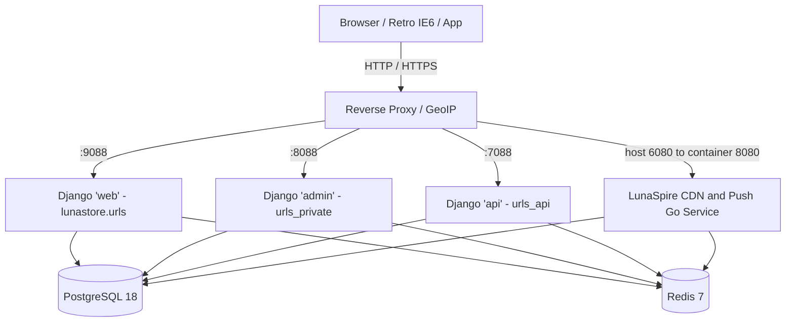

# LunaStore Developer & Agent Guide

This skill provides step-by-step operating procedures, mental models, and architectural reference links for working effectively inside the **LunaStore** repository without needing to re-scan the entire codebase.

---

## Architecture At A Glance



Optional analytics: ClickHouse via compose profile `analytics` (`make dev-analytics-up`), consumed by `apps/analytics` when `ANALYTICS_ENABLED` is true.

For full system architecture and service boundaries, read [architecture.md](./references/architecture.md).

---

## Core Workflows & Runbooks

### 1. Adding or Modifying Django Models
1. Choose the proper app:
   - `apps/marketplace/models.py`: Applications, Categories, Badges, Distributions, Reviews, Collections, Moderation Requests.
   - `apps/user/models.py`: Custom User, UserBan, DevRequests, BlacklistedUsername, InviteToken, UserSession, NoSpamRule, NoSpamEvent.
   - `apps/core/models.py`: Banners, global helpers.
   - `apps/terms/models.py`: Multilingual legal documents.
   - `apps/analytics/`: Optional ClickHouse analytics (gated by `ANALYTICS_ENABLED`).
2. If the model should soft-delete, inherit from `SafeDeleteModel` with `_safedelete_policy = SOFT_DELETE` or `SOFT_DELETE_CASCADE`. Not all models use soft delete (e.g. `Badge`, `Review`, `InviteToken`, `UserSession`, `NoSpamRule`, `Banner`, `LegalDocument`).
3. If fields need translation (e.g. `title`, `description`, `name`), register them in `apps/<app_name>/translation.py`. Languages: `ru`, `en`, `uk`, `be`, `kk`.
4. Register the model in `admin.py` (using `django-unfold` `ModelAdmin` classes where appropriate).
5. Generate and apply migrations:
   ```bash
   make dev-makemigrations
   make dev-migrate
   ```
6. Read the deep dive: [backend-django.md](./references/backend-django.md).

---

### 2. Working on Frontend & Internet Explorer 6 Compatibility
1. **Never edit files in `static/js/` directly** — they are generated!
2. Write JavaScript in [`staticfiles/js/`](../../staticfiles/js/).
3. Transpile JavaScript targeting IE6 via Babel:
   ```bash
   npm run babel:build
   ```
4. For all URLs referring to LunaSpire CDN or media assets, use **protocol-relative URLs** (e.g. `//spire.lunastore.app/...` or `obj.icon_url`) to avoid mixed-content and HTTPS/TLS handshake failures in legacy Windows XP browsers.
5. If using PNG images with alpha channel transparency for IE6, use `dd_belatedpng.min.js` behavior classes (`.png-fix`).
6. Read the deep dive: [frontend-ie6.md](./references/frontend-ie6.md).

---

### 3. Creating & Updating API Endpoints
LunaStore provides two API flavors in `apps/api/`:
- **V1 Legacy RPC API (`/method/`)**:
  - Located in `apps/api/views.py`.
  - Slash-separated `@action` paths (e.g. `/method/user/getProfileInfo/`, `/method/marketplace/getAppInfo/`).
  - JSON envelope `{ "response": ... }` or LunaException error shape.
- **V2 Modern REST API (`/v2/`)**:
  - Located in `apps/api/v2/views.py`.
  - JWT auth (`/v2/auth/token/`), `ExecuteView` at `/v2/execute/` (body key `code`, max 25 calls), OpenAPI via `drf-spectacular`.
  - Resources: `user`, `marketplace`, `category`, `service`, `distribution`, `collection` (collections are read-only).
- Read the deep dive: [api-reference.md](./references/api-reference.md).

---

### 4. Working with LunaSpire (CDN & Storage & Notifications)
1. **Storage & Uploads**:
   - Files are uploaded through signed tokens signed with `settings.LUNASPIRE_SECRET_KEY`.
   - LunaSpire provides direct file serving, hash checking, and rate-limiting.
2. **Notifications**:
   - Dispatched via `NotificationService.send_notification(user_id, title, content, meta)` in `apps/core/notifications/services.py`.
   - Real-time or polled delivery on frontend via `global_notifications.js` with signed receive tokens.
3. Read the deep dive: [architecture.md](./references/architecture.md).

---

### 5. Managing Security, Anti-Spam & Moderation
1. **noSpam Engine**:
   - Handled in `apps/user/services/antispam.py`.
   - Checks entrypoints (`register`, `login`, `jwt_token`, `profile_update`, `dev_status`) against active `NoSpamRule` models cached in Redis (`nospam_rules_v1`).
   - Supports CIDR matching, regex on email/username/UA, GeoIP country code checks, invite token limits, and request burst rate signals.
2. **Email & User Verification**:
   - `validate_email_mx` validates MX DNS records with caching and blocks disposable email domains using `disposable_email_domains`.
3. **IP bans**:
   - Redis key `banned_ips_list`. Checks run from views/forms via `BlockBannedIP` helpers; the class is **not** registered in global `MIDDLEWARE`.
4. **Audit Logging**:
   - Admin and moderator actions are automatically formatted by `LoggerService` and posted to Telegram via `send_telegram_notification`.
5. Read the deep dive: [security-nospam.md](./references/security-nospam.md).

---

### 6. Linting, Testing & Common Runbook Commands
- **Lint Python code**:
  ```bash
  pycodestyle . --exclude=.venv,venv,migrations,.git --max-line-length=120
  ```
- **Run Django tests**:
  ```bash
  make dev-test
  ```
- **Sync translations**:
  ```bash
  make i18n-sync
  ```
- Read the full command reference: [runbook-dev.md](./references/runbook-dev.md).

---

## Detailed Reference Index

| Topic | Reference Document | Key Focus Areas |
| :--- | :--- | :--- |
| **System Architecture** | [architecture.md](./references/architecture.md) | Multi-container setup, LunaSpire CDN, GeoIP, optional ClickHouse analytics |
| **Django Backend** | [backend-django.md](./references/backend-django.md) | Apps breakdown, models, soft-delete exceptions, signals, Constance |
| **API Endpoints** | [api-reference.md](./references/api-reference.md) | V1 RPC (`/method/`), V2 REST (`/v2/`), JWT Auth, Execute batching |
| **Frontend & IE6** | [frontend-ie6.md](./references/frontend-ie6.md) | IE6/XP compatibility, Babel pipeline, CSS structure, DD_belatedPNG |
| **Security & noSpam** | [security-nospam.md](./references/security-nospam.md) | AntiSpamService, NoSpamRule, IP bans, 2FA, session tracking |
| **Dev Runbook** | [runbook-dev.md](./references/runbook-dev.md) | Docker commands, Makefile, `run-dev.ps1`, troubleshooting |
