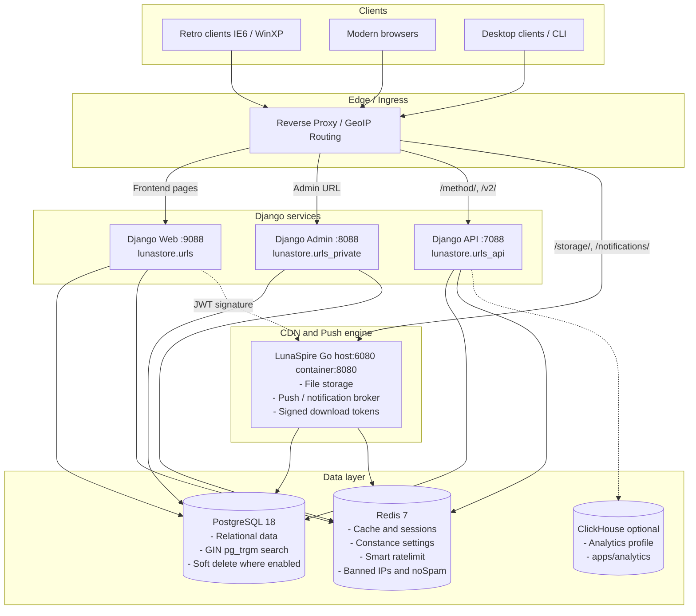
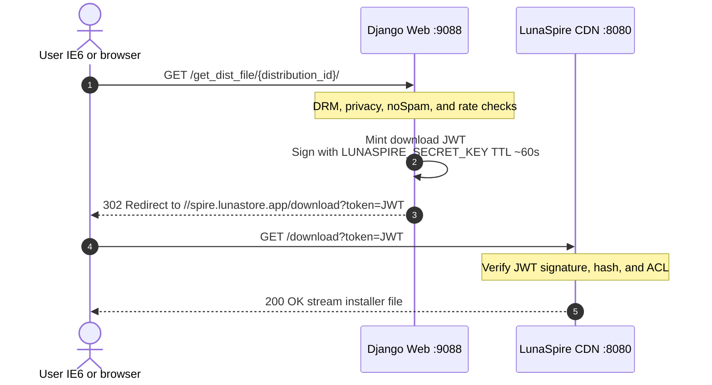

# LunaStore System Architecture

This document describes the overall architecture of **LunaStore**: service layout, network topology, **LunaSpire** CDN integration, GeoIP domain routing, and the secure download lifecycle.

---

## Service overview

LunaStore is a modular Django monolith paired with the **LunaSpire** Go microservice. In Docker, services are split for load isolation and clear ownership boundaries:



---

## Containers and services

### 1. `web` (user-facing frontend)
- **Container:** `lunastore_web`
- **Port:** `9088` (proxied to 80/443 in production)
- **Root URLConf:** `lunastore.urls`
- **Responsibilities:**
  - Storefront routes (`/index.php`, `/category/`, `/app/`, `/download/`, and related `.php`-style paths).
  - User account, registration, login, TOTP 2FA.
  - Developer forms for app and distribution publish/edit requests.
  - User collections.
  - Server-rendered HTML with strict Internet Explorer 6 compatibility.
  - Also mounts `/method/` for legacy clients hitting the main site.

### 2. `admin` (moderation and management)
- **Container:** `lunastore_admin`
- **Port:** `8088`
- **Root URLConf:** `lunastore.urls_private`
- **Responsibilities:**
  - Django Unfold admin under secret path `/${ADMIN_URL}/`.
  - Moderation of `AppCreateRequests`, `AppEditRequests`, `DistributionCreateRequests`, `DistributionEditRequests`.
  - IP ban list, noSpam rules, blacklisted usernames.
  - Mass user scan tool: `/${ADMIN_URL}/nospam/mass-scan/`.
  - Global notification broadcast: `/${ADMIN_URL}/broadcast/`.
  - OIDC (Authentik SSO) for moderators and admins.

### 3. `api` (API gateway)
- **Container:** `lunastore_api`
- **Port:** `7088`
- **Root URLConf:** `lunastore.urls_api`
- **Responsibilities:**
  - **V1 Legacy RPC (`/method/`)**: response format suited to desktop apps and older libraries.
  - **V2 REST (`/v2/`)**: JWT auth, `ExecuteView` batching, Swagger UI / OpenAPI (`/schema/`).

### 4. `lunaspire` (CDN, storage, push)
- **Repository:** `https://github.com/DanielMTeam/lunaspire` (submodule at `./lunaspire`)
- **Ports:** container `8080`, host-mapped as `6080` (`"6080:8080"` in compose)
- **Stack:** Go
- **Responsibilities:**
  - Store and stream installer binaries.
  - SHA256 hash validation and access control via JWT signed with `LUNASPIRE_SECRET_KEY`.
  - Push notification broker (`/notifications/send`, `/notifications/list`).

### 5. `db` (PostgreSQL 18)
- **Port:** `5432`
- **Notes:**
  - `pg_trgm` for fuzzy full-text search (`GinIndex` with `gin_trgm_ops`).
  - Soft delete via `django-safedelete` on many (not all) models.

### 6. `redis` (Redis 7)
- **Port:** `6379`
- **Uses:**
  - Query/ORM caching and Django sessions.
  - Rate limiting (`django-smart-ratelimit`, `RateLimitMiddleware` when enabled).
  - Banned IP set cache (`banned_ips_list`) and noSpam rules (`nospam_rules_v1`).
  - `django-constance` config cache.

### 7. `clickhouse` (optional analytics)
- **Image:** `clickhouse/clickhouse-server` (compose profile `analytics`)
- **App:** `apps/analytics`
- **Gate:** Constance / env `ANALYTICS_ENABLED`
- **Commands:** `make dev-analytics-up`, `make dev-analytics-migrate`, `make dev-analytics-ping`

---

## Domain routing and GeoIP (`GeoDomainMiddleware`)

LunaStore supports dynamic geo routing via [`GeoDomainMiddleware`](../../../apps/core/middleware.py):

1. Incoming requests resolve the real client IP (`apps.core.utils.get_client_ip`).
2. MaxMind GeoIP2 (`geo.mmdb` under `apps/core/geolocation/`) yields a two-letter country code.
3. Constance stores JSON `GEO_DOMAIN_OVERRIDES`, for example:
   ```json
   {
     "RU": {
       "BASE_URL": "ru.lunastore.app",
       "API_URL": "api.ru.lunastore.app",
       "SPIRE_URL": "spire.ru.lunastore.app"
     }
   }
   ```
4. Matching countries are redirected to the regional mirror while preserving path and query.
5. Static/media paths (`/staticfiles/`, `/media/`) skip redirects to avoid loops.

---

## Secure file download lifecycle (CDN flow)



---

## Dynamic settings sync (Constance → .env)

1. An admin changes site settings under `/${ADMIN_URL}/constance/config/`.
2. The `config_updated` signal fires in [`apps/core/constance_sync.py`](../../../apps/core/constance_sync.py).
3. The changed key is written into `.env` via `dotenv.set_key`.
4. Values take effect immediately in the Constance Redis cache and persist across container restarts via `.env`.
