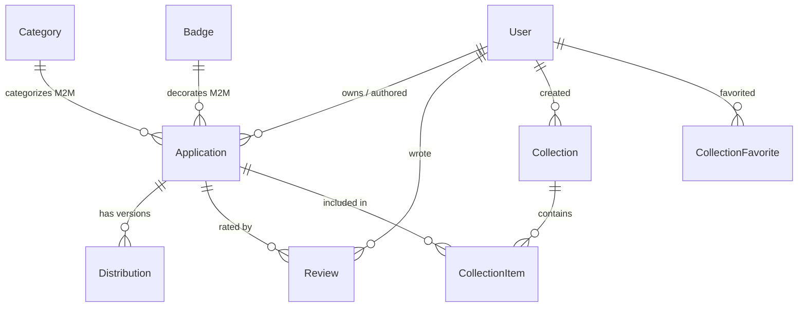

# Django Backend: Structure, Apps, and Models

Guide to the `apps/` packages, domain models, soft delete, modeltranslation, signals, and middleware.

---

## App layout (`apps/`)

```text
apps/
├── core/           # Shared utils, banners, GeoIP, Telegram logging, Constance sync
├── user/           # Custom User, sessions, bans, TOTP 2FA, invites, noSpam engine
├── marketplace/    # Catalog, distributions, moderation, collections, reviews
├── api/            # API v1 (RPC /method/) and API v2 (REST /v2/)
├── terms/          # Legal documents (Privacy Policy, ToS) with multilanguage support
└── analytics/      # Optional ClickHouse analytics (ANALYTICS_ENABLED)
```

---

## Domain models and relationships

### 1. Application catalog (`apps.marketplace`)



- **`Category`**: `name`, `description`, `icon`, `is_admin_only`, `banner_filename`. Soft-deletes with `SOFT_DELETE_CASCADE`. Translated fields use `name_*` (not `title_*`).
- **`Badge`**: `name`, `predefined_style`, `icon_class`, `icon_text`, `bg_color`, `text_color`, `border_color`. **Hard delete** (`models.Model`, not `SafeDeleteModel`).
- **`Application`**: Main app entity.
  - Inherits `BaseApplicationInfo` and `SafeDeleteModel`.
  - Fields: `title`, `slogan`, `description`, `requirements`, `original_author`, `price`, `screenshots` (JSON path list), `developer_site`, `is_demo`, `is_private`, `allow_reviews`, `is_under_dmca`.
  - Search: `GinIndex` with `gin_trgm_ops` on `['title', 'description', 'slogan']`.
  - Properties `icon_url` and `screenshot_urls` return protocol-relative LunaSpire CDN URLs.
- **`Distribution`**: A concrete release/installer.
  - Fields: `app`, `version`, `cdn_file_id`, `url` (external link), `changelog`, `release_description`.
  - Property `link` routes downloads through `/get_dist_file/<id>/`.
- **`Review`**: 1–5 star rating. **Hard delete**.
- **`Collection` / `CollectionItem` / `CollectionFavorite`**:
  - User-curated app lists.
  - System likes collection via `get_or_create_likes_collection(user)` with constraint `uniq_system_collection_per_owner`.
  - `mosaic_icons(limit=4)` builds a 2×2 icon preview.

### 2. Moderation requests (`apps.marketplace`)
- **`AppCreateRequests`**: New application submission.
- **`AppEditRequests`**: Edit existing app (`target_application`).
- **`DistributionCreateRequests`**: New release with VirusTotal URL (`virustotal_url`) and CDN hash (`cdn_hash`).
- **`DistributionEditRequests`**: Release edit request.
- **`AppReportRequests`**: User reports (malware, broken links, etc.).
- **`ProblemReportRequests`**: Platform bug/problem reports.

Statuses: `pending`, `approved`, `rejected`. Creating a request fires a Telegram notification to moderators.

### 3. Users and security (`apps.user`)
- **`User`**:
  - `AbstractUser` + `SafeDeleteModel`.
  - Unique `email` with `validate_email_mx` (MX check + disposable domain block).
  - Social: `telegram`, `discord`, `openvk`, `website`.
  - TOTP 2FA: `totp_secret`, `totp_enabled`.
  - Avatars: `avatar_id`, `avatar_path`, property `avatar_url`.
  - Invites: `invited_by`.
- **`UserBan`**: User and/or IP ban (`ban_by_ip`, `is_permanent`, `expires_at`, `reason`). Soft-deletes.
- **`InviteToken`**: Invite token (hard delete). Auto-refreshes on a 24h cycle.
- **`UserSession`**: Active sessions (`session_key`, `ip`, `user_agent`, `last_activity`). Hard delete.
- **`BlacklistedUsername`**: Forbidden username words/regexes. Soft-deletes.
- **`NoSpamRule` & `NoSpamEvent`**: Anti-abuse rules and event log. **Hard delete**.

### 4. Legal documents (`apps.terms`)
- **`LegalDocument`**: Types `privacy`, `rules`, `terms` with language (`ru`, `en`, `uk`, `be`, `kk`) and Markdown body. Hard delete.

### 5. Analytics (`apps.analytics`)
- Optional ClickHouse pipeline controlled by `ANALYTICS_ENABLED` (Constance / `.env`).
- Management commands: `analytics_migrate`, `analytics_ping`, `seed_analytics`.
- Compose service `clickhouse` uses profile `analytics`.

---

## Soft delete (`django-safedelete`)

- Many catalog and user models inherit `safedelete.models.SafeDeleteModel`.
- `instance.delete()` sets `deleted` (timestamp); the row stays in PostgreSQL.
- QuerySet behavior:
  ```python
  # Default: only non-deleted
  Application.objects.all()

  # Include deleted
  Application.objects.all_with_deleted()

  # Deleted only (trash)
  Application.objects.deleted_only()
  ```
- Cascade soft delete: `_safedelete_policy = SOFT_DELETE_CASCADE`.
- Do not assume every model soft-deletes — check the class bases first.

---

## Model multilanguage (`django-modeltranslation`)

- Registrations live in `apps/<app_name>/translation.py`.
- Example: `Application` and `Category` register fields such as `title`/`name`, `description`, `slogan`, `requirements`.
- DB columns: `title_ru`, `title_en`, `title_uk`, `title_be`, `title_kk` (and equivalents).
- Forms helpers `get_translated_fields_list` / `get_translated_widgets_dict` expand locale fields and tabs in the frontend and Unfold admin.

---

## Signals

1. **`apps/marketplace/signals.py`**:
   - `post_save` on request models sends formatted Telegram cards to moderators.
2. **`apps/user/signals.py`**:
   - `UserBan` create/delete refreshes banned-IP cache (`refresh_banned_ips_cache`).
   - `NoSpamRule` changes clear `AntiSpamService.clear_rules_cache()`.
   - Banning a user kicks active sessions (`kick_from_session_on_ban`).
   - Login success/failure audit to `LogEntry` and Telegram.
3. **`apps/core/constance_sync.py`**:
   - Listens to Constance `config_updated` and syncs keys into `.env`.

---

## Middleware stack (order)

Actual `MIDDLEWARE` in `lunastore/settings.py` (simplified):

1. **`corsheaders.middleware.CorsMiddleware`**
2. **`django.middleware.security.SecurityMiddleware`** / **`whitenoise.middleware.WhiteNoiseMiddleware`**
3. Sessions, locale, common, CSRF, auth, messages, clickjacking
4. **`django_user_agents.middleware.UserAgentMiddleware`**
5. **`apps.user.middleware.UserSessionMiddleware`** — tracks authenticated sessions; updates `last_activity` about every 5 minutes
6. **`apps.core.middleware.GeoDomainMiddleware`** — GeoIP country → regional domain redirects
7. **`apps.core.middleware.RateLimitMiddleware`** — included only when `RATE_LIMIT_ENABLED` is true; global IP limiter via Redis; skips static assets

**Not in global middleware:** `apps.user.middleware.BlockBannedIP`. Ban checks use `BlockBannedIP.get_banned_set()` from views/forms. Redis cache key: `banned_ips_list`.
