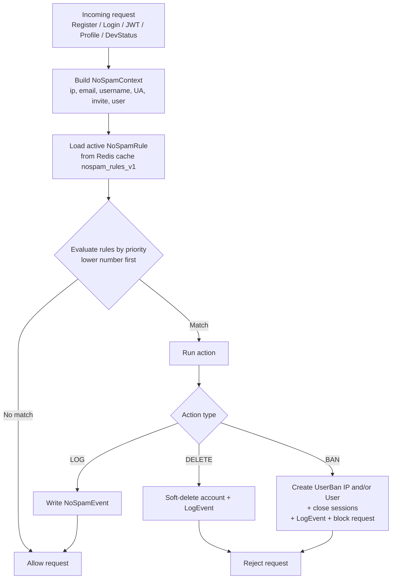

# Security, noSpam, and Abuse Protection

Security components for **LunaStore**: the **noSpam** engine, validation, sessions, bans, and TOTP 2FA.

---

## noSpam engine architecture

Implemented in [`apps/user/services/antispam.py`](../../../apps/user/services/antispam.py). It blocks spam registrations, botnets, and abusive actions on key entrypoints.

---

## `NoSpamRule` model and filter types

Each rule defines an entrypoint, match criteria, priority, and action.

### 1. Entrypoints
- `register` — new account registration
- `login` — site login
- `jwt_token` — API v2 JWT token obtain
- `profile_update` / `profile_email` / `profile_username` — profile changes
- `dev_status` — developer status application

### 2. Match types (`match_type`)
| Match type | `pattern` format | Behavior |
| :--- | :--- | :--- |
| `email_domain` | `tempmail.com` | Exact email domain match |
| `email_regex` | `.*@.*\.xyz$` | Email regex |
| `username_regex` | `^bot_\d+` | Username regex |
| `ip_cidr` | `192.168.1.0/24` | Client IP in CIDR |
| `user_agent_regex` | `(?i)python-requests` | User-Agent regex |
| `country_code` | `CN,KP` | GeoIP2 country codes |
| `invite_pattern` | `INVITE-.*` | Invite code regex |
| `request_rate_signal` | `5/10` | More than N requests in M seconds |
| `user_id_range` | `100:500` | User IDs in inclusive range |

### 3. Actions
- **`log`**: Allow the request; write `NoSpamEvent`.
- **`ban`**: Create `UserBan`, close sessions, refresh banned-IP Redis cache, block the request.
- **`delete`**: Soft-delete the user.

### 4. Rule caching
- Rules cached in Redis under `nospam_rules_v1`.
- Create/update/delete of a rule in admin clears the cache via `AntiSpamService.clear_rules_cache()` in `apps/user/signals.py`.

---

## Mass scan tool (`admin_nospam_mass_scan`)

Admin tool URL:
`GET /${ADMIN_URL}/nospam/mass-scan/`

Runs active rules (or a selected rule) against existing users in **dry run** or live apply mode.

---

## IP bans (`BlockBannedIP`)

- Class: `apps.user.middleware.BlockBannedIP`.
- **Not registered in global `MIDDLEWARE`.** Ban checks are invoked from views/forms via `BlockBannedIP.get_banned_set()`.
- Redis cache key: **`banned_ips_list`** (see `apps/user/tasks.py` `CACHE_KEY`).
- Cache refresh: `refresh_banned_ips_cache` on `UserBan` changes.
- When a banned IP is blocked in a view path, the retro page `banned_ip.html` may be returned with status 403.

---

## Email validation (`validate_email_mx`)

[`apps/user/validators.py`](../../../apps/user/validators.py) enforces multi-step email checks on registration:

1. **Syntax:** Django `validate_email` (RFC-style).
2. **No `+` aliases:** Addresses like `user+test@gmail.com` are rejected.
3. **Disposable domains:** Blocked via `disposable-email-domains`.
4. **MX DNS lookup:**
   - MX lookup with a hard ~2.0s timeout.
   - Redis cache: valid domains **24h**, invalid **1h**.

---

## TOTP 2FA

- Libraries: `pyotp`, `qrcode`.
- User fields: `totp_secret` (Base32), `totp_enabled`.
- **Enable flow:**
  1. User opens `/settings/security/`.
  2. Secret + QR for Google Authenticator / Aegis / 2FAS.
  3. Confirm with a valid 6-digit code.
- **Login flow:**
  1. If `totp_enabled`, session enters `2fa_pending` after password check.
  2. User completes `/2fa/attempt/` with the TOTP code.
- API JWT login may require `totp_code` in the token request body.

---

## Username blacklist (`BlacklistedUsername`)

- Forbidden words/regexes for usernames.
- Validator `validate_username_blacklist` runs on register and nick changes.
- Cached in Redis; invalidated on `post_save` / `post_delete`.

---

## Activity log / retention (`UserActivityLog`)

- Records user actions with IP and timestamp.
- Constance / `.env` `RETENTION_ACTIVITY_LOG_DAYS` controls retention (`0` disables long-term PII retention by default).
- Cleanup: `python manage.py clear_trash`.
